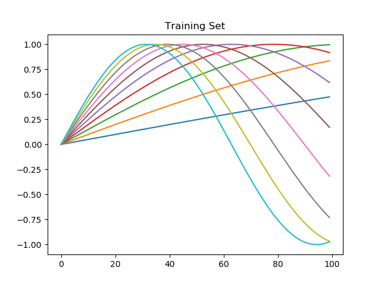

OptEvolver
==============================

Evolutionary parameter search for architecture and hyperparameters

## Project Organization

    ├── LICENSE
    ├── Makefile           <- Makefile with commands like `make data` or `make train`
    ├── README.md          <- The top-level README for developers using this project.
    ├── data
    │   ├── external       <- Data from third party sources.
    │   ├── interim        <- Intermediate data that has been transformed.
    │   ├── processed      <- The final, canonical data sets for modeling.
    │   └── raw            <- The original, immutable data dump.
    │
    ├── docs               <- A default Sphinx project; see sphinx-doc.org for details
    │
    ├── examples           <- Directory that has self-contained examples from this package
    │
    ├── models             <- Trained and serialized models, model predictions, or model summaries
    │
    ├── notebooks          <- Jupyter notebooks. Naming convention is a number (for ordering),
    │                         the creator's initials, and a short `-` delimited description, e.g.
    │                         `1.0-jqp-initial-data-exploration`.
    │
    ├── references         <- Data dictionaries, manuals, and all other explanatory materials.
    │
    ├── reports            <- Generated analysis as HTML, PDF, LaTeX, etc.
    │   └── figures        <- Generated graphics and figures to be used in reporting
    │
    ├── requirements.txt   <- The requirements file for reproducing the analysis environment, e.g.
    │                         generated with `pip freeze > requirements.txt`
    │
    ├── setup.py           <- makes project pip installable (pip install -e .) so src can be imported
    ├── src                <- Source code for use in this project.
    │   ├── __init__.py    <- Makes src a Python module
    │   │
    │   ├── generators     <- Scripts to download or generate data
    │   │   ├── descending.py
    │   │   ├── floatfunctions.py
    │   │   ├── intfunctions.py
    │   │   ├── JackTorrance.py
    │   │   └── texttokenizer.py    
    │   │
    │   ├── hyperparameter  <- Scripts to evolve hyperparameters and architecture
    │   │   ├── EnumeratedTypes.py
    │   │   ├── EvolutionaryOptimizer.py
    │   │   ├── ModelWriter.py
    │   │   ├── TF2OptimizationTestBase.py
    │   │   └── TF2OptimizationTest.py
    │   │
    │   ├── util           <- Scripts for various utilities
    │   │   ├── excel_utils.py
    │   │   ├── file_parser.py
    │   │   └── JsonUtils.py
    │
    └── tox.ini            <- tox file with settings for running tox; see tox.testrun.org

--------

<small>Project based on the <a target="_blank" href="https://drivendata.github.io/cookiecutter-data-science/">cookiecutter data science project template</a>. #cookiecutterdatascience</small>

<h1>Package Tutorials</h1>

Conceptually, there are two parts to this package. The core is the <b>EvolutionaryOptimizer.py</b> module, that builds a population of <em>Genomes</em>, and evolves that population over multiple generations against a fitness test. Two additional files, <b>TF2OptimizerTestBase.py</b> and <b>TF2OptimizerTest.py</b> demonstrate how to use the evolver to search hyperparameter and architecture spaces with Tensorflow 2.x. 

This tutorial will have two parts - the first will walk through a simple example that uses the evolver alone. The second will build an ensemble of tensorflow models, take their average fitness, and evolve a multilayer perceptron network to do sequence-to-sequence matching.

<h2>EvolutionaryOptimizer Tutorial</h2>
(The code for this tutorial is in the optevolver/examples/EO_example.py file)

This example creates a set of parameters for the evolver to work with, does an exhaustive evaluation for comparison, and then evolves a solution. Some graphs are generated at the end to show the fitness landscape, and the exhaustive and evolved solutions. To run the example, you will have to (pip) install the <b>optevolver</b> package

<h3>Imports</h3>
The following are required for this example:
<pre>
import random
from typing import Dict, Tuple

import matplotlib.pyplot as plt
import matplotlib.cm as cm
import numpy as np
from mpl_toolkits.mplot3d import axes3d, Axes3D  # <-- DON'T DELETE, and note the capitalization!

import optevolver.hyperparameter.ValueAxis as VA
import optevolver.hyperparameter.EvolutionaryOptimizer as EO
</pre>

<h3>Example evaluation function</h3>
This is the function that is used to produce a fitness value. An "arguments" Dict  is passed in with the values to work with It's ['X'] and ['Y'] in this case, but it can be Ebochs, Batch size, Neurons per layer, etc. The function returns two Dicts (d1, d2), where d1 must contain: 
- d1: {EvolverTags.FITNESS.value : <some fitness value>}  
- d2: data that will be recorded to the spreadsheet for post-hoc analysis 
<pre>
def example_evaluation_function(arguments: Dict) -> Tuple[Dict, Dict]:
    x = arguments['X'] + random.random() - 0.5
    y = arguments['Y'] + random.random() - 0.5
    val = np.cos(x) + x * .1 + np.sin(y) + y * .1

    return {EO.EvolverTags.FITNESS.value: val}, {
        EO.EvolverTags.FILENAME.value: "{}.tf".format(arguments[EO.EvolverTags.ID.value])}
</pre>

<h3>Example save function</h3>
Called from the evolver when a new best average fitness is found, so that the new best results can be written out
<pre>
def example_save_function(name: str) -> str:
    # do something with the new best value
    return "new best value: {}".format(name)
</pre>

<h3>Setting the values to evolve</h3>
Set up the 'X' and 'Y' values so a finite number of options are generated. In this case, the value is an array of float that goes from -5.0 to 5.0 in 0.25 increments. That's 40 values per dimension. Since we'll be calculating a surface, the total number of points on this surface will be 40 * 40 or 1,600.
<pre>
v1 = VA.EvolveAxis("X", VA.ValueAxisType.FLOAT, min=-5, max=5, step=0.25)
v2 = VA.EvolveAxis("Y", VA.ValueAxisType.FLOAT, min=-5, max=5, step=0.25)
</pre>

<h3>Calculate the grid search version as a baseline</h3>
Iterate over the ranges in v1 and v2 and get a fitness value from our example_evaluation_function(). We set the initial fitness (prev_fitness) to -10, and every time we find a better value, we add that to our exhaustive_list so we can see how many steps it took. 
<pre>
prev_fitness = -10
count = 0
exhaustive_list = []
for x in range(len(v1.range_array)):
    for y in range(len(v2.range_array)):
        count += 1
        args = {'X': v1.range_array[x], 'Y': v2.range_array[y], EO.EvolverTags.ID.value: "eval_[{}]_[{}]".format(x, y)}
        d1, d2 = example_evaluation_function(args)
        cur_fitness = d1[EO.EvolverTags.FITNESS.value]
        if (cur_fitness > prev_fitness):
            prev_fitness = cur_fitness
            exhaustive_list.append(cur_fitness)
</pre>

<h3>Set up for the evolver </h3>
Now do the same thing using evoultionary fitness landscape evaluation. We first create an instance of the EvolutionaryOpimizer that keeps the top 50% of the genomes for each generation, and runs on zero threads.  
Threads can equal the number of processors. Zero is best for stepping through code in a debugger.
<pre>
eo = EO.EvolutionaryOpimizer(keep_percent=.5, threads=0)
</pre>

Add the already created EvolveAxis to the EvolutionaryOptimizer in any order.
<pre>
eo.add_axis(v1)
eo.add_axis(v2)
</pre>

Create an initial population of 10 genomes.
<pre>
eo.create_intital_genomes(10)
</pre>

<h3>Run the evolver </h3>
Run for the same number of steps that it took to create the exhaustive list. Note - this is completely arbitrary so that some nice plots can be made. In an actual version, there should ba a max number of iterations that a fitness no longer improve.  

Create a List of fitness values to plot.
<pre>
evolve_list = []
</pre>
Set the number of generations. We'll just go for the same number of steps as we saved off when doing the grid search. This will make for a nicer plot later.
<pre>
num_generations = len(exhaustive_list) 
for i in range(num_generations):
    # evolve a generation, providing the evaluation and save functions, and a crossover and mutation rate of 50%
    fitness = eo.run_optimizer(example_evaluation_function, example_save_function, crossover_rate=0.5, mutation_rate=0.5)
    evolve_list.append(fitness)
</pre>

<h3>Show results</h3>

First, print out all the genome data, and also the best genome
<pre>
print("xxxxxxxxxxxxxxxx\n{}".format(eo.to_string()))

best_genome = eo.get_ranked_genome(0)
best_genome_data = best_genome.get_data_list()
d: Dict
print("best genome = {}".format(best_genome.get_name()))
for i in range(len(best_genome_data)):
    d = best_genome_data[i]
    for key, val in d.items():
        print("data [{}]: {} = {}".format(i, key, val)
</pre>

Next, save the results to a spreadsheet for post hoc analysis.
<pre>
eo.save_results("evolve_test.xlsx")
</pre>
The saved spreadsheet will include all the best values for each generation and can be used to make nice plots:

Last, plot the exhaustive and evolve sequences. The exhaustive line is almost deterministic and will pretty much look the same for each run. The evolved line is stochastic, and can change significantly for each run.

<pre>
fig = plt.figure(1)
plt.plot(exhaustive_list)
plt.plot(evolve_list)
plt.legend(["exhaustive ({} iterations)".format(count), "evolved ({} iterations)".format(num_generations)])

# draw a picture of our XY fitness landscape. This is the same range used to create the axis and the same equation in
# def example_evaluation_function(arguments: Dict) -> Dict:
fig = plt.figure(2)
ax = fig.gca(projection='3d')

# Make our 3d surface using the same equation in example_evaluation_function()
X = np.arange(-5, 5, 0.25)
Y = np.arange(-5, 5, 0.25)
X, Y = np.meshgrid(X, Y)
R = np.cos(X) + X * .1 + np.sin(Y) + Y * .1
Z = R

# Plot the surface.
surf = ax.plot_surface(X, Y, Z, cmap=cm.coolwarm, linewidth=0, antialiased=False)

# s Show the plots
plt.show()
</pre>

This gives us two plots. The first is a 3D surface of our fitness landscape: 

The second is a plot of best values. Here we can see the result of the earlier, exhaustive search. It took a total of 1,600 steps, and found a new best value 16 times. The evolutionary approach ran for just 16 generations, with a population of 10 for each calculation for a total of 160 steps. For a true apples to apples comparison, the grid search should work with an ensemble of 10 samples as well, so the evolutionary approach is at least 100 times faster than the grid search, and nearly as effective.

<h2>TF2OptimizationTest Tutorial</h2>
(The code for this tutorial is in the optevolver/examples/TF2_opt_example.py file)

This example extends the <b>TF2OptimizerTestBase</b> to build a simple dataset and evolve a model's architecture and hyperparameters to map an input sequence vector to an output sequence vector using a simple multilayer perceptron. To ensure that the fitness values are repeatable, an <em>Ensemble</em> of ten models is generated using the same Genome. We do this because the random initialization of weights can create a wide range in performance of a model. At the end of the example, we'll see how the individual predictions from each model can be combined to make an average prediction which should be far more reliable. To run the example, you will have to (pip) install the latest version of the <b>optevolver</b> package:

<pre>pip install optevolver</pre>

<h3>Imports</h3>
The following are required for this example:

<pre>
import numpy as np
import time
import tensorflow as tf
from tensorflow_core.python.keras import layers
from typing import Dict, Tuple

import optevolver.generators.FloatFunctions as FF
import optevolver.hyperparameter.EvolutionaryOptimizer as EO
import optevolver.hyperparameter.ModelWriter as MW
import optevolver.hyperparameter.ValueAxis as VA
from optevolver.hyperparameter.TF2OptimizerTestBase import TF2OptimizationTestBase
</pre>

<h3>Overriding the TF2OptimizerTestBase class</h3>
The TF2OptimizerTestBase class has the parts needed to build and evaluate one Tensorflow 2.x model. The EvolutionaryOptimzer will work with a population of ten of these classes that will have the same hyperparameters and architecture elements, but will be initialized with different weights, so they will have different fitness values. These will be averages and used to calculate the best generation(s) 

<pre>
class TF2OptExample(TF2OptimizationTestBase):
    """
    Class that creates a working implementation of the TF2OptomizerTestBase class, This gives an example of how to
    override the generate_train_test() and build_model() methods. The eval_func() and save_func() functions that 
    are defined later in this file are used to evaluate each model and save the current and best ensemble. 
    """

    def __init__(self, sequence_length: int = 100, device: str = "gpu:0"):
        """ Example of how to override the init while passing values through to the base class 
        Parameters
        ----------
        sequence_length: int = 100
            The sice of the input and output vectors. Defaults to 100
        device: str = "gpu:0"
            The string used to set the Tensorflow distribution strategy. If, for example, the machine that this
            was running on had four cpus, an instance of this class would be created for 'cpu:0', 'cpu:1', 'cpu:2', and
            'cpu:3'. Default is 'gpu:0'
        """
        super().__init__(sequence_length, device=device)

    def generate_train_test(self, num_functions: int, rows_per_function: int, noise: float) -> \
            (np.ndarray, np.ndarray, np.ndarray):
        """ Overriding the base class' method to generate some data procedurally, but you could read in as well.
        This method is also used for plotting results. The values are set using a set of frequencies for a sin function. 
        All sequences start at sin(0) = 0, then diverge from there. Returns a tuple of (full_mat, train_mat, text mat),
        where the test and train matrices are made of the evenly split full matrix.

        Parameters
        ----------
        num_functions: int
            the number of sin-based functions to create
        rows_per_function: int
            the number of rows to create for each sin function. With noise == 0, these rows would be identical
        noise: float
            the amount of noise to add to each generated value
        """

        ff = FF.FloatFunctions(rows_per_function, 2 * self.sequence_length)
        npa = None
        for i in range(num_functions):
            mathstr = "math.sin(xx*{})".format(0.005 * (i + 1))
            # generate a dataframe that with values
            df2 = ff.generateDataFrame(mathstr, noise=noise)
            # convert the DataFrame to an Numpy array
            npa2 = df2.to_numpy()

            # if this is the first time, set the initial value, otherwise append
            if npa is None:
                npa = npa2
            else:
                ta = np.append(npa, npa2, axis=0)
                npa = ta

        # split into the train and test matrices
        split = np.hsplit(npa, 2)

        # return the tuple
        return npa, split[0], split[1]

    def build_model(self, args: Dict) -> tf.keras.Sequential:
        """
        Overrides the base class' method that builds a tf.keras.Sequential model and returns it. All arguments are passed 
        in the form of a Dict, so that there can be any amount of paramaters used to produce the model. In this example 
        case, a multilayer perceptron is built using a Dict that would contain {'num_neurons' : x, 'num_layers' : y}. The 
        model is defined to run on the device passed in (or the default of 'gpu:0') to the constructor. Returns an executable
        model with input and output size of self.sequence_length

        Parameters
        ----------
        num_functions: int
            the number of sin-based functions to create
        rows_per_function: int
            the number of rows to create for each sin function. With noise == 0, these rows would be identical
        noise: float
            the amount of noise to add to each generated value
        """
        with self.strategy.scope():
            # make a copy of the args that we can manipulate
            self.model_args = args.copy()

            # some defaults
            num_layers = 1
            num_neurons = 200

            #change the defaults if there are args in the Dict to do so
            if 'num_neurons' in self.model_args:
                num_neurons = self.model_args['num_neurons']
            if 'num_layers' in self.model_args:
                num_layers = self.model_args['num_layers']

            # create the model
            self.model = tf.keras.Sequential()

            # Add the input layer with sequence_length units to the model
            self.model.add(layers.Dense(self.sequence_length, activation='relu', input_shape=(self.sequence_length,)))
            # Add the number of layers and neurons as specified in the args
            for i in range(num_layers):
                self.model.add(layers.Dense(num_neurons, activation='relu'))
            # Add the output layer with sequence_length units to the model
            self.model.add(layers.Dense(self.sequence_length))

            # set up our loss and optimization functions. These could be passed in as well
            loss_func = tf.keras.losses.MeanSquaredError()
            opt_func = tf.keras.optimizers.Adam(0.01)

            # create the model
            self.model.compile(optimizer=opt_func,
                               loss=loss_func,
                               metrics=['accuracy'])
        #return the model
        return self.model
</pre>

<h3>Setting up the eval and save functions</h3>
In addition to the two functions, we set up a few global variables here

<h3>Global variables</h3>
<pre>
in_out_vector_size = 100
eval_folder_name = "./eval"
best_folder_name = "./best
</pre>

<h3>Example evaluation function</h3>
<pre>
def eval_func(arguments: Dict) -> Tuple[Dict, Dict]:
    """
        This function takes the argument Dict, creates a TF2OptExample class, builds and evaluates the model,
        and returns two Dicts, one for the evaluation stats and one to provide a filename for the model to be saved
        as 'best', if it has better results than a previous run.

        Parameters
        ----------
        arguments : Dict
            all the arguments that this function would need. The defaults, passed in from
            EvolutionaryOpimizer.run_optimizer() are passed into TF2OptimizationTestBase.build_model(), where
            they are stored and used by evaluate_madel

    """
    # set up device-specific threading. Default is the gpu
    device_name = "gpu:0"
    if EO.EvolverTags.THREAD_NAME.value in arguments:
        device_name = arguments[EO.EvolverTags.THREAD_NAME.value]

    # Instantiate the class
    tf2o = TF2OptExample(in_out_vector_size, device=device_name)

    # build the model, based on the argments passed in from the evolver
    tf2o.build_model(arguments)
    # evaluate the model, based on the argments passed in from the evolver
    d1 = tf2o.evaluate_model(num_functions=10, rows_per_function=1, noise=0)

    # prepare our return Dicts. Note that our fitness value could be some other value, or calculated here
    d1[EO.EvolverTags.FITNESS.value] = d1['accuracy']
    filename = "model_{}.tf".format(arguments[EO.EvolverTags.ID.value])
    d2 = {"filename": filename}
    MW.write_model(eval_folder_name, filename, tf2o.model)
    return d1, d2
 </pre>
<h3>Example save function</h3>
<pre>
def save_func(name: str) -> str:
    """
        This function is called if the evaluated model from eval_func() has a new 'best' fitness value. It deletes the
        best directory, renames the current eval directory to the best directory, creates a new, empty eval directory,
        and returns a status string

        Parameters
        ----------
        name : str
            A label that this class returns that the EvolutionaryOptimizer can keep track of

    """
    MW.del_dir(best_folder_name)
    MW.move_dir(eval_folder_name, best_folder_name)
    MW.create_dir(eval_folder_name)
    filename = "{}/config.txt".format(best_folder_name)
    with open(filename, "w") as f:
        f.write("config = {}".format(name))
    return "saved {}".format(name)
</pre>
<h3>Set up the evolver for training</h3>
This should look almost identical to the <b>EvolutionaryOptimizer</b> example above. We are using the same EvolveAxis class, but we are setting them to different values, INTEGER, in this case.
<pre>
# set up the filename that we will save our statistics to
timestr = time.strftime("%H-%M_%m-%d-%Y", time.gmtime())
filename = "./evolve_{}.xlsx".format(timestr)

# create independent EvolveAxis for hyperparameters (epochs and batch_size), and architecture search (num_neurons, num_layers)
v1 = VA.EvolveAxis("epochs", VA.ValueAxisType.INTEGER, min=10, max=100, step=10)
v2 = VA.EvolveAxis("batch_size", VA.ValueAxisType.INTEGER, min=2, max=20, step=1)
v3 = VA.EvolveAxis("num_neurons", VA.ValueAxisType.INTEGER, min=10, max=1000, step=10)
v4 = VA.EvolveAxis("num_layers", VA.ValueAxisType.INTEGER, min=1, max=10, step=1)

# create the EvolutionaryOptimizer and add the EvolveAxis
eo = EO.EvolutionaryOpimizer(threads=0)
eo.add_axis(v1)
eo.add_axis(v2)
eo.add_axis(v3)
eo.add_axis(v4)
</pre>

Set up the populations. Create a set of 10 randomly-generated genomes that will be the population that we start with.

<pre>eo.create_intital_genomes(10)</pre>

Set up the directory that we will save our current ensemble (defined as a global variable above)
<pre>MW.create_dir(eval_folder_name)</pre>

<h3>Run the evolver</h3>
We will evolve over num_generations. Crossover rate is the chance that one parent will contribute its EvolveAxis value to the newly created offspring. Mutation rate is the chance that a gene will change after the initial crossover. Once crossover and mutation are finished, the newly instantiated genome is added to the population.
<pre>
num_generations = 15
crossover_rate = 0.5
mutation_rate = 0.5
for i in range(num_generations):
    tf.keras.backend.clear_session() # Needed to clear models from the gpu
    # run the optimizer with references to the eval and save functions, plus the crossover and mutation
    # rate. One of the reasons that we do this is that it can make sense to start with a high mutation and
    # crossover rate, but as we hillclimb, we may want more conservative values
    best_ensemble_average_fitness = eo.run_optimizer(eval_func, save_func, crossover_rate, mutation_rate)

    # print the current results
    print("best average fitness (generation {}) = {:.3f}".format(i, best_ensemble_average_fitness))
</pre>

I'd like to emphasize the line
<pre>tf.keras.backend.clear_session()</pre>
It turns out that Keras likes to hang onto models. Over time, these models accumulate onto the GPU, and you start having memory allocation errors like this:

<em><a href="https://stackoverflow.com/questions/46066850/understanding-the-resourceexhaustederror-oom-when-allocating-tensor-with-shape">OOM when allocating tensor with shape[X,Y]</a></em>
 
Most of the answers will talk about that you need to limit batch size, or other memory improving techniques. But it can also happen with small models like this one. The clear_session() call takes care of such cases. Note that clear_session() must be called outside of any device-specific code.
 
<h3>Show results</h3>
 
First, display the name of the best genome. It will be something like "90_10_860_1", which would be 90 epochs, 10 batch size, 860 neurons, 1 layer.
 
 <pre>
best_genome = eo.get_ranked_genome(0)
print("best genome = {}".format(best_genome.get_name()) </pre>

Next, save the data from the runs in a spreadsheet for post-hoc analysis. This data gives a good indication of how variable the accuracy of a model can be. 
<pre>eo.save_results(filename)</pre>
In this case, the evolver created ten identical models and evaluated them. When we look at the data we can see the variability for each model and the overall improvement:

 

Although the mean, 5% and 95% accuracy results seem reasonable, the outliers show how variable the results can be. This is why you can't expect repeatability in a trained model. There are several configurations where the range in performance is from 30% to 90%, and one configuration that produces 0% <em>and</em> 100% accuracy! The other issue is that the best values are close to random. It would be impossible to tease out the contribution from the changes in hyperparameters from the random assignment of weights. 

<em>Moral of the story</em>: You can only get reliably repeatable results of the type needed for any hyperparameter optimization from <em>ensembles</em> of identical models.

Ok, back to the code. 

We're now going to plot the training data, the best ensemble, the ensemble average, and the ground truth that we used for this example. The first thing that we do is to create an instance of the  TF2OptExample, which can read in and evaluate an ensemble:

<pre>tfo = TF2OptExample()</pre>

Then, using the defaults, we read in each model and make an ensemble:
<pre>tfo.plot_population(best_folder_name, noise=0.0)</pre>

This will produce charts that resemble the following. First, the data set that was used as the input (training set) vector and the output (ground truth):

 

Next, we'll have two chrats that show the predictions from each of the models from an ensemble.  The first is from an early generation, before good values had been chosen:

We can see that network has learned quite a bit, but the results are quite noisy. After a few more generations, the results are <em>much</em> better: 

Lastly, we can take the average of each prediction, and produce a plot that is extremely similar to the ground truth:

That's it! All the code is documented for pydoc, and can be navigated by launching the documentation browser:
<pre>python -m pydoc -b</pre>

Thank you for coming to my TED talk.

